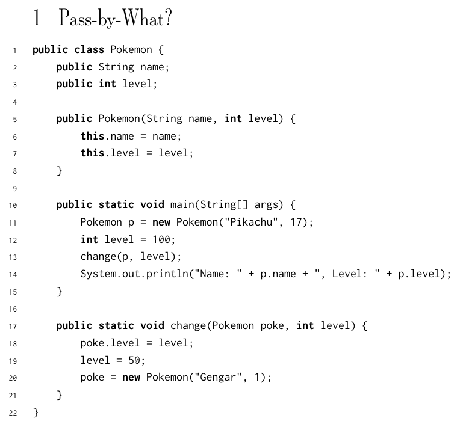

# Discussion 2

## 1 - Pass by What?



**What would Java display**?

"Name: Pikachu, Level: 100"

The assignment on line 19 rebinds the local variable `level` to a new value, it has no effect on the level of `poke` that was set above. Similarly, the instantiation on line 20 rebinds the local variable `poke` to a new Pokemon object.

## 2 - Static Methods and Variables


Output:

```
Nyan! I'm Cream the cat!
Nyan! I'm Tubbs the cat!
<as above but with 'nyan!'>
```

Why? Because setting static fields and calling static methods using an instance of the class is treated the same as performing those actions on the class itself

