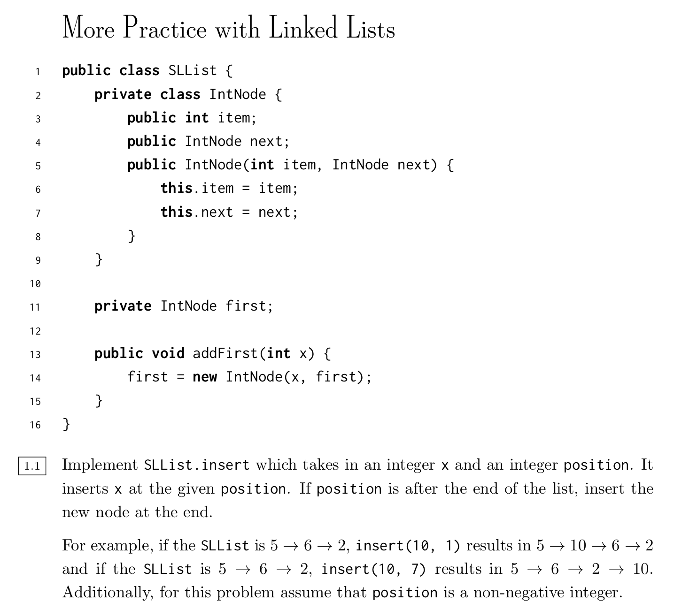

# More Practice with Linked Lists



```java
public class SLList {
  private class IntNode {
		public int item;
		public IntNode next;
		public IntNode(int item, IntNode next) {
			this.item = item; 
      this.next = next;
    }
  }
  
  private IntNode first;
	
  public void addFirst(int x) { 
    first = new IntNode(x, first);
	} 
  
  public void insert(int item, int position) {
    /**
    	Inserts item at position. 
    	If position is after the end of the list, inserts item at the end.
    	Position is nonnegative.
    */
    if (position == 0 || first == null) {
      addFirst(item);
      return;
    }
    
    int spacesMoved = 1;
    IntNode prevNode = first;
    IntNode currNode = first.next;
    while (spacesMoved < position && currNode.next != null) {
      prevNode = currNode;
      currNode = currNode.next;
      spacesMoved += 1;
    }
    
    prevNode.next = new IntNode(item, currNode);
  }
  
  public void reverse() {
    /**
	    Recursively reverses the items in the linked list
	  */
    recReverse(null, first);
  }
  
  public void recReverse(prevNode, currNode) {
    // Reverse these nodes
    oldNextNode = currNode.next;
    currNode.next = prevNode;
    
    // Base case: return if we've reached the end of the list
    if (oldNextNode == null) {
      return;
    }
    
    recReverse(currNode, oldNextNode);
  }
}

```

