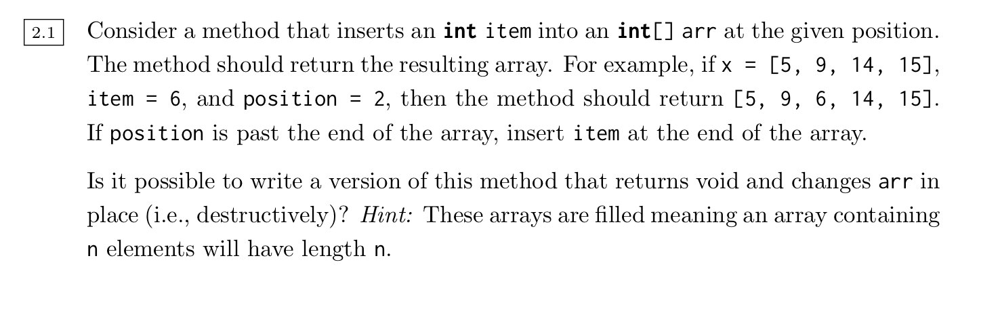

# Arrays




No: arrays are immutable, a new object has to be created


```java
public static int[] insert(int[] arr, int item, int position) {
  int newLength = arr.length + 1;
  int[] newArr = int[newLength];
  position = Math.min(arr.length, position);
  
  // Could have two System.arraycopys instead
  for (int preIdx = 0; preIdx < position; preIdx++) {
    newArr[preIdx] = arr[preIdx];
  }
  
  newArr[position] = item;
  
  for (int postIdx = position+1; postIdx < newLength; postIdx++) {
    newArr[postIdx] = arr[postIdx-1];
  }
  
  return newArr;
}
```


