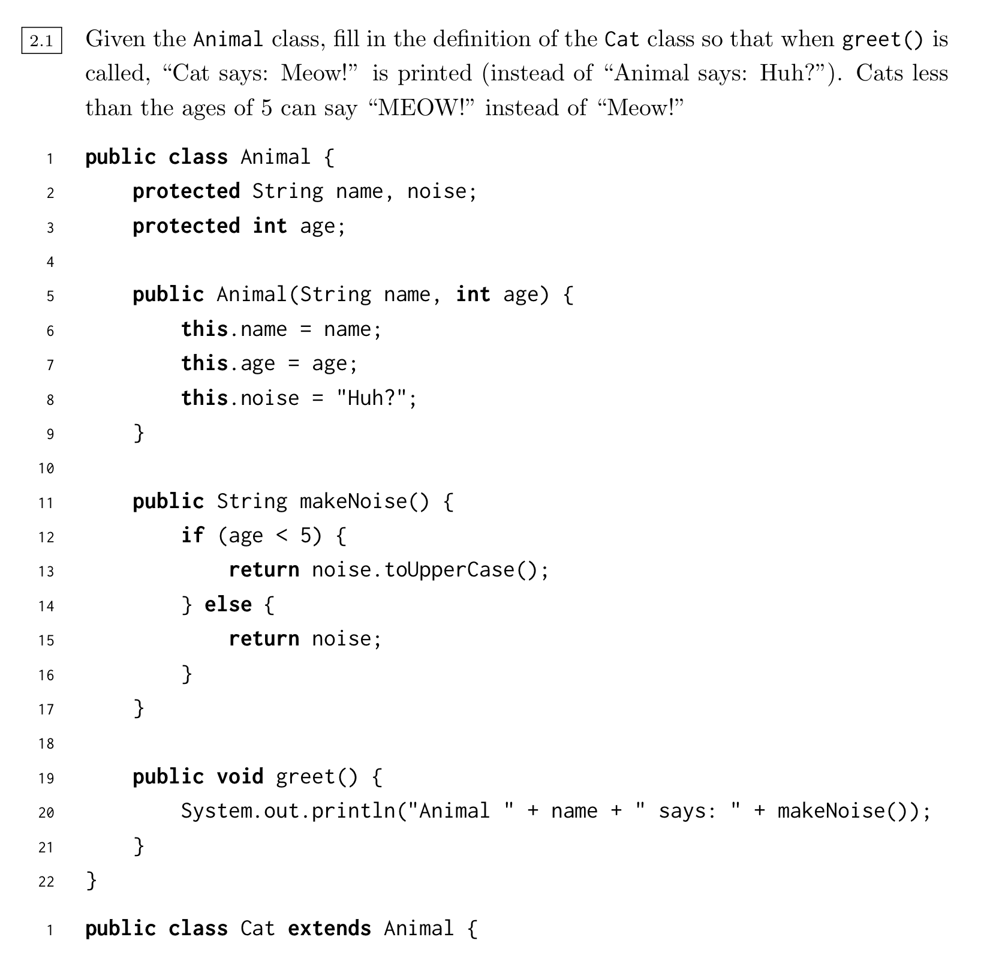

# Discussion 4 (Spring 2019)



```java
public class Cat extends Animal {
  public Cat (String name, int age) {
    super(String name, int age);
    this.noise = "Meow!"
  }
  
  public void greet() {
  	System.out.println("Cat says: " + makeNoise());
  }
}
```


## Q4

Lines: 

- 20-22
- 27: this version of the method (ie with the particular signature) is not defined in the static type, so the dynamic type can't call it
- 33
- 37
- 40: can't cast void

